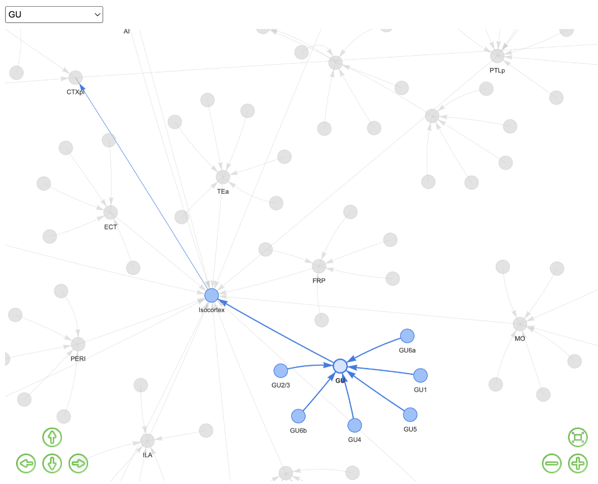

# Project Overview
This project is designed to compare the tree structures from two datasets and visualize these structures. 

The datasets are in CSV and JSON formats, and the functions in this project will determine whether the tree structures from these formats are the same or not, and provide visualization for the structures.

## Data Sources 
This project utilises data from @ytsimon2004

## Features
- Compare tree structures from structure_tree_safe_2017.csv and structures.json in test_files.
- Supports both CSV and JSON input formats to determine if the tree structures are identical.
- visualisation the tree structures using R tools.

## Installation
- install R or R studio
- Clone this repository to your local machine

## How to use
### #todo

## Visualisation

